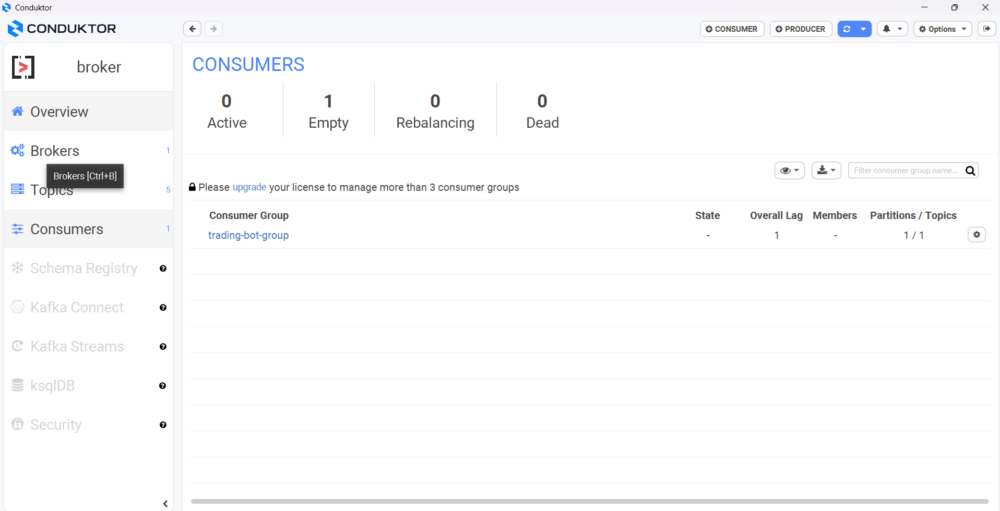

# Crypto Trading Streaming ETL Pipeline

## Description
A data engineering–focused project that streams real-time cryptocurrency market data via WebSocket, processes it using Apache Kafka, and analyzes streaming data for technical indicators and visualization.

## Technologies
- Python (confluent_kafka)
- Web Socket (websocket)
- Apache Kafka (processing streaming data)
- Docker (local deployment)
- Chart real-time CLI (asciichartpy)

## Architecture

## How to Run
1. Clone the repository:  
   `git clone https://github.com/your-username/your-repo.git`
2. Start Docker services:  
   `docker-compose up -d`   
3. Set up your configuration:  
   Change the configuration to suit your needs
4. Start binance streaming file:  
   `python -m data_stream.binance_producer`
5. Start bot trading file:
   `python -m trading.bot`
6. Start chart CLI file:
   `python ui/usdt_chart.py`

